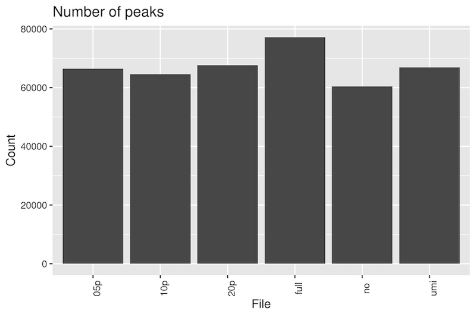
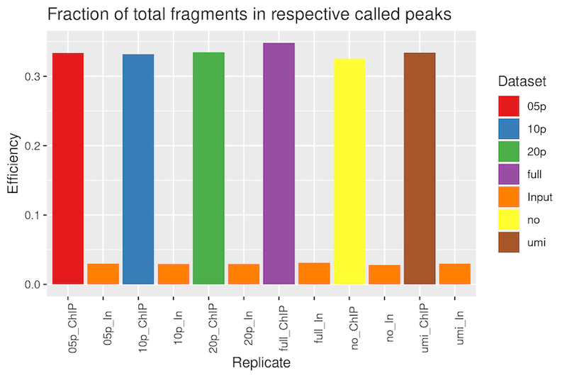
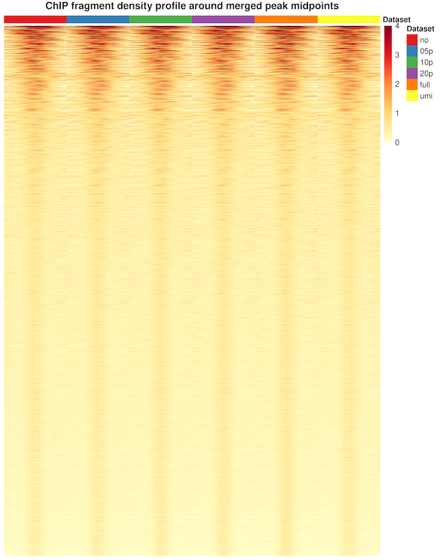
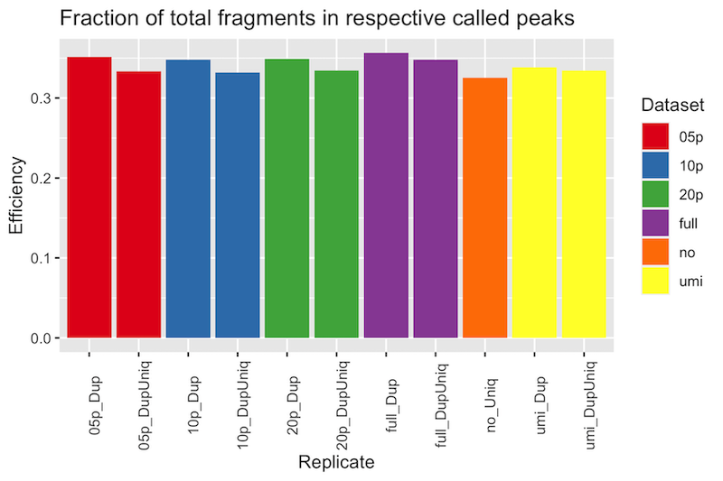

# RNA Polymerase II ChIPSeq Partial Duplication Example

An example of RNA Polymerase II ChIPSeq from mammalian cells. The ChIP samples were
prepared with NEBNext Ultra II DNA Library kit and sequenced on a NovaSeq 6000. This
ChIPSeq had a total of 105M alignments. After removing 15M optical duplicates (based
on a pixel distance of 2500), the UMI duplication rate was 36% resulting in 57M
unique alignments. This was one of three comparable biological duplicates.

See the [BASH script](duplication_comparison_cmd.sh) for the exact pipeline used in 
processing.

### Peak call number

The number of peaks called between different subsets shows more variance than with
H3K4me3. In this case, removing all duplicates identifies the least number of peaks,
while including all duplicates calls 28% more peaks. The number of peaks called using
UMI-deduplicated alignments most closely matches the number called with 5 percent
retained duplicates. 

The mean peak length was 1140 ± 1883 bp, median 635 bp at a threshold q-value of 2. 

### ChIP Efficiency

The fraction of alignments within the respectively called peaks was quite good, with 
nearly identical fractions between the subsets, ranging from 33-35%. 

### Peak Fragment Coverage Profile

The depth-normalized fragment coverage profile over the called peak midpoint ± 1 Kb 
shows no difference between the subsets.

### Comparison of Duplicate Alignments Within Peaks

To compare the influence of retained duplicate alignments on the ChIP efficiency, the
fraction of alignments (used in the peak call) within each respectively called peaks
was compared with the fraction of completely de-duplicated alignments. Each fraction
was plotted below.

In all cases, a higher percentage of duplicate-containing alignments were observed in
the peaks than completely deduplicated alignments, indicating there are indeed
duplicate alignments found within peaks. Notably, however, the difference is only a
few percentage points, and more importantly, very little with UMI-deduplicated
alignments. 

### Conclusion

In this RNA Polymerase II ChIPSeq, peak calling with 5 percent retained duplicate 
alignments most closely matches the true peak call set with UMI deduplicated alignments
when considering the number of peaks called. These call sets have 89% spatial overlap 
(Jaccard statistic; not shown). 

When comparing the fraction of alignments with and without duplicates within called 
peaks, there is very little additional fraction of duplicates within peaks. In fact, 
the percentages are almost identical with UMI de-duplication, indicating that biological 
duplication does not in fact play a large contributing factor.

