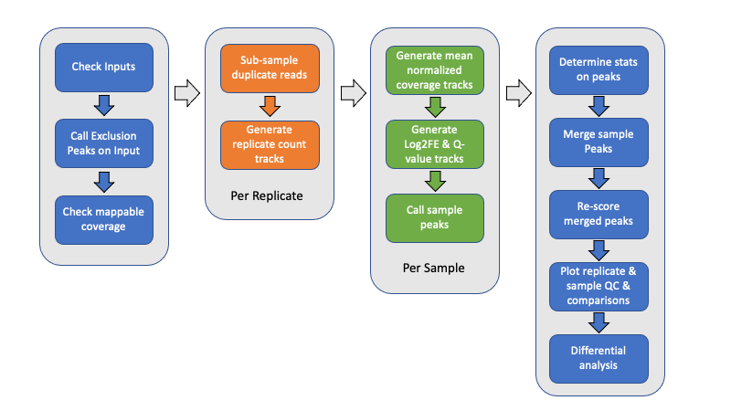

# Multi-Replica Macs ChIPSeq Wrapper

A multi-threaded wrapper for processing multi-replicate, multi-condition ChIPSeq samples

## Description

ChIPSeq and related methods, such as ATACSeq, is increasingly being used not just as 
a means of discovery ("where is my factor binding?") but also as an assay for experimental 
conditions ("how does my mutant affect factor X occupancy?"). Many traditional ChIPSeq 
programs are not necessarily well equipped to handle multiple replicates and/or sample 
conditions.

This is a wrapper application for processing ChIPSeq samples 
comprised of multiple biological replicas and/or multiple conditions in a manner to 
make comparisons as consistent and uniform as possible across samples. 

## Rationale

The venerable [Macs2](https://pypi.org/project/MACS2/) application provides a robust
method of determining enrichment of ChIP fragments over input with a number of
advantages: fragment-based pileup of ChIP signal versus simple counts, single
base-pair resolution instead of sliding windows, estimation of local chromatin bias
using multiple window sizes, and more. However, Macs2 does not natively deal with
replicates, and comparing multiple conditions requires careful, manual execution 
of each set with identical parameters and/or complicated intersections. 

This package aims to automate Macs2 ChIPSeq peak calling with support for multiple 
replicas and conditions while supporting newer normalization methods. Importantly, it 
will output normalized, processed bigWig enrichment files for subsequent genic analysis; 
numerous analytical, comparative, and QC metric plots; and peak count tables ready for 
quantitative differential analysis.

## Overview

Above is a graphical overview of the pipeline. Below is a description of the steps.
Here, _samples_ are used to mean separate experimental conditions (antibody,
treatment, genetic status, time point, whatever), while _replicates_ are used to
indicate one or more biological samples (animals, culture, etc) of the same
condition. Technical replicates could also be included.

- Generate exclusion list

    Unless provided with an exclusion (black) list, an empirically-derived exclusion 
    list is automatically generated from the Control reference files by combining all 
    of the control files (without deduplication) and calling peaks. Exclusion lists 
    are critical to removing potential false positives and removing a large source of 
    duplicate alignments.

- Calculate mappable size

    Unless provided with an explicit, effective genome size, the effective mappable 
    size is calculated empirically from all provided alignment files using 
    [report_mappable_space](applications.md#report_mappable_spacepl). Having an 
    accurate, experiment-based genome size should provide a more accurate statistical 
    estimation of peak enrichment.

- Filter alignments

	Alignment files may be filtered for a variety of reasons, including overlapping 
	exclusion intervals, unwanted chromosomes (mitochondrial, alternate haplotypes, 
	unmapped contigs, and/or decoy sequences), duplicate alignments (optical or 
	PCR-derived), secondary and supplemental alignments, and mapping quality. 
	
	An optional step can include sub-sampling PCR-duplicates to a consistent level. 
	See the [De-Duplication Evaluation](DeDuplicationEvaluation/ReadMe.md) for 
	further details.
    
- Generate replicate tracks 

    To facilitate generating count matrices later, point-data count bigWig files,
    either shifted start positions (single-end) or fragment midpoints (paired-end),
    are generated using [bam2wig](https://metacpan.org/pod/bam2wig.pl) for each
    sample replicate. By default, replicates are depth-normalized and scaled to the
    target depth (calculated automatically as the minimum observed depth of all
    provided Bam files). 
    
    When independent replicate peaks are called too, fragment coverage tracks for
    each replicate are also generated.
    
- Independent-replicate peak calls

    When indicated, independent peak calls may optionally be generated for each 
    replicate using [Macs2](https://pypi.org/project/MACS2/). These replicate peaks 
    are then intersected to generate a consensus peak call set for the sample using 
    [intersect_peaks](applications.md#intersect_peakspl). By default, consensus 
    peaks must be identified from (n - 1) replicates.

- Generate replicate-mean fragment coverage and enrichment files

    Generate per-sample mean fragment coverage for both ChIP and corresponding 
    reference control using [bam2wig](https://metacpan.org/pod/bam2wig.pl). This 
    averages sample replicates in a depth-normalized manner, ensuring that all 
    replicates have the same weight when making peak calls.

    [Macs2](https://pypi.org/project/MACS2/) is used to generate q-value and Log2 Fold
    Enrichment tracks from the mean-replicate ChIP fragment coverage and lambda 
    control files for each sample.

- Call peaks

    Use [Macs2](https://pypi.org/project/MACS2/) to call peaks from the mean-replicate
    q-value tracks for each sample separately using the indicated threshold, minimum
    peak size, and peak gap size for merging. The peak call parameters can be
    explicitly specified for custom control. Broad, or gapped-peak, calls may also be
    made if desired.

- Intersect peaks

    Use [intersect_peaks](applications.md#intersect_peakspl) to intersect the peaks
    from each ChIP sample into a master list of peaks across all ChIP conditions,
    as well as generate a variety of statistics regarding the peaks and their
    overlap. This is done for both mean-replicate and independent-replicate samples. 
    These statistics are plotted as QC plots by 
    [plot_peak_figures](applications.md#plot_peak_figuresr).

- Rescore merged peaks

    Use [get_datasets](https://metacpan.org/pod/get_datasets.pl) to generate matrices
    of log2 Fold Enrichment scores, q-value scores, coverage, and count data for the
    merged list of peaks. Also, use
    [get_relative_data](https://metacpan.org/pod/get_relative_data.pl) to collect the
    profile of plots using both fragment coverage and log2 Fold Enrichment scores 
    around the peak summit or midpoint.

- Plot replicate and sample QC and heat maps

    A variety of replicate and sample QC plots, correlation plots (Euclidean
    distance, PCA, Pearson, and Spearman), heat maps, and line plots are generated
    using a custom R script, [plot_peak_figures](applications.md#plot_peak_figuresr).

- Differential analysis

    The merged peaks may then be evaluated for differential occupancy between two or
    more samples using rigorous statistical analysis. For example,
    [DESeq2](https://bioconductor.org/packages/DESeq2/) may be used to identify
    significantly different peaks. Some basic R scripts are included to perform such
    analysis on an ad hoc basis.

# Usage and installation

See the accompanying [Installation guide](INSTALL.md), [Usage Guide](Usage.md), and 
[list of application menus](applications.md) for further information. Examples and 
example scripts are provided in the [examples directory](examples/Readme.md).

# AUTHOR

    Timothy J. Parnell, PhD
    Bioinformatics Shared Resource
    Huntsman Cancer Institute
    University of Utah
    Salt Lake City, UT, 84112

# LICENSE

This package is free software; you can redistribute it and/or modify
it under the terms of the Artistic License 2.0. For details, see the
full text of the license in the file LICENSE.

This package is distributed in the hope that it will be useful, but it
is provided "as is" and without any express or implied warranties. For
details, see the full text of the license in the file LICENSE.
