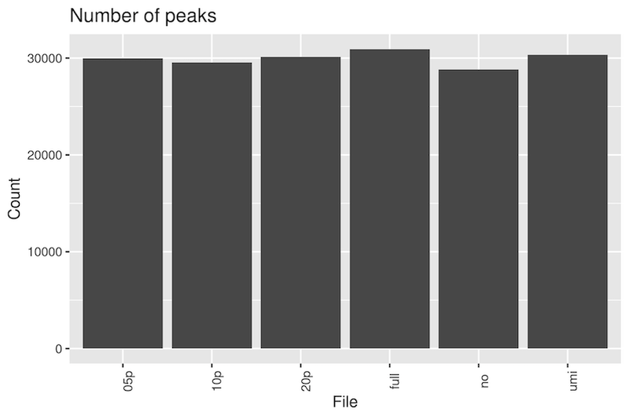
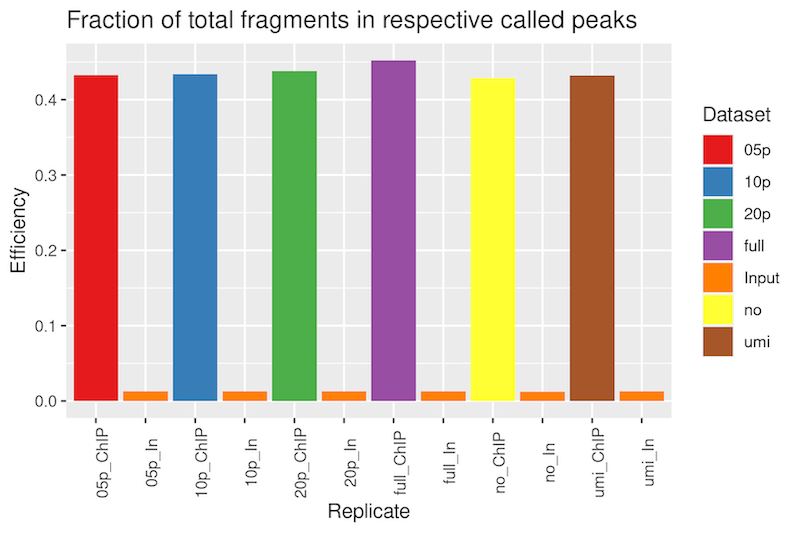
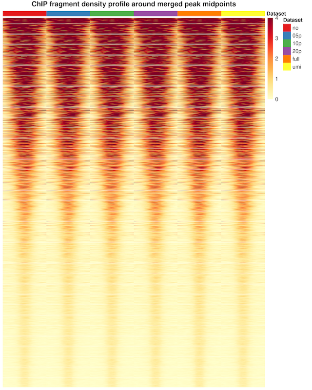
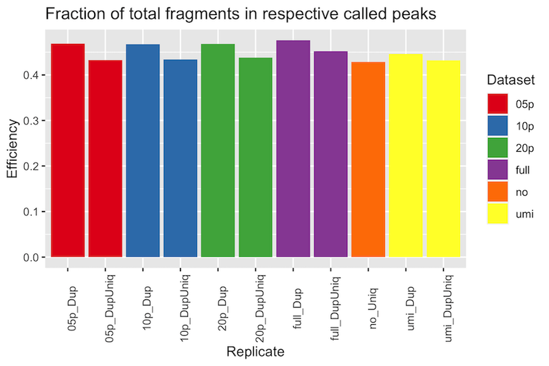

# H3K4me3 ChIPSeq Partial Duplication Example

An example of H3K4me3 ChIPSeq from mammalian cells. The ChIP samples were prepared with 
NEBNext Ultra II DNA Library kit and sequenced on a NovaSeq 6000. This ChIPSeq had a 
total of 115M alignments. After removing 17M optical duplicates (based on a pixel 
distance of 2500), the UMI duplication rate was 33% resulting in 66M unique alignments.
This was one of two comparable biological duplicates.

See the [BASH script](https://github.com/HuntsmanCancerInstitute/MultiRepMacsChIPSeq/blob/master/docs/DeDuplicationEvaluation/duplication_comparison_cmd.sh)
for the exact pipeline used in processing.

### Peak call number

The number of peaks called between different subsets were nearly identical. Using all 
alignments called the most number of peaks. The mean peak length was 1568 ± 1140 bp, 
median 1350 bp at a threshold q-value of 2. 

### ChIP Efficiency

The fraction of alignments within the respectively called peaks was quite good, with 
nearly identical fractions between the subsets, ranging from 43-45%. 

### Peak Fragment Coverage Profile

The depth-normalized fragment coverage profile over the called peak midpoint ± 1 Kb 
shows no difference between the subsets.

### Comparison of Duplicate Alignments Within Peaks

To compare the influence of retained duplicate alignments on the ChIP efficiency, the
fraction of alignments (used in the peak call) within each respectively called peaks
was compared with the fraction of completely de-duplicated alignments. Each fraction
was plotted below.

In all cases, a higher percentage of duplicate-containing alignments were observed in
the peaks than completely deduplicated alignments, indicating there are indeed
duplicate alignments found within peaks. Notably, however, the difference is only a
few percentage points, and more importantly, very little with UMI-deduplicated
alignments. 

### Conclusion

In this particular H3K4me3 ChIPSeq, retaining duplicate peaks has mostly negligible 
effects, either positively or negatively. This implies that the duplicate alignments 
are fairly randomly distributed, and not necessarily concentrated in peaks. Part of 
this may be due to the relatively broad nature of these H3K4me3 peak calls.

