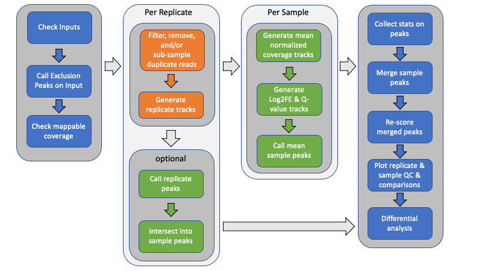

# MultiRepMacsChIPSeq - Overview

|[Home](Readme.md)|[Overview](Overview.md)|[Usage](Usage.md)|[Variations](Variations.md)|[Examples](Examples.md)|[Applications](applications.md)|[Install](Install.md)|

## Overview

Above is a graphical overview of the pipeline. Below is a description of the steps.
Here, _samples_ are used to mean separate experimental conditions (antibody,
treatment, genetic status, time point, whatever), while _replicates_ are used to
indicate one or more biological samples (animals, culture, etc) of the same
condition. Technical replicates could also be included.

- Generate exclusion list

	Unless provided with an exclusion (black) list, an empirically-derived exclusion 
	list is automatically generated from the Control reference files by combining all 
	of the control files (without deduplication) and calling peaks. Exclusion lists 
	are critical to removing potential false positives and removing a large source of 
	duplicate alignments.

- Calculate mappable size

	Unless provided with an explicit, effective genome size, the effective mappable 
	size is calculated empirically from all provided alignment files using 
	[report\_mappable\_space](applications/report_mappable_space.md). Having an 
	accurate, experiment-based genome size should provide a more accurate statistical 
	estimation of peak enrichment.

- Filter alignments

	Alignment files may be filtered for a variety of reasons, including overlapping 
	exclusion intervals, unwanted chromosomes (mitochondrial, alternate haplotypes, 
	unmapped contigs, and/or decoy sequences), duplicate alignments (optical or 
	PCR-derived), secondary and supplemental alignments, and mapping quality. 
	
	An optional step can include sub-sampling PCR-duplicates to a consistent level. 
	See the [De-Duplication Evaluation](DeDuplicationEvaluation/ReadMe.md) for 
	further details.
	
- Generate replicate count tracks 

	To facilitate generating count matrices later, point-data count bigWig files,
	either shifted start positions (single-end) or fragment midpoints (paired-end),
	are generated using
	[bam2wig](http://tjparnell.github.io/biotoolbox/apps/bam2wig.html) for each
	sample replicate. By default, replicates are depth-normalized and scaled to the
	same target depth (by default the median observed depth of all provided Bam
	files). 
	
	When independent replicate peaks are called too, fragment coverage tracks for
	each replicate are also generated.
	
- Independent-replicate peak calls

	When indicated, independent peak calls may optionally be generated for each 
	replicate using [Macs2](https://pypi.org/project/MACS2/). These replicate peaks 
	are then intersected to generate a consensus peak call set for the sample using 
	[intersect_peaks](applications/intersect_peaks.md). By default, consensus 
	peaks must be identified from (n - 1) replicates.

- Generate replicate-mean fragment coverage and enrichment files

	Generate per-sample mean fragment coverage for both ChIP and corresponding
	reference control using
	[bam2wig](http://tjparnell.github.io/biotoolbox/apps/bam2wig.html). This averages
	sample replicates in a depth-normalized manner, ensuring that all replicates have
	the same weight when making peak calls.

	[Macs2](https://pypi.org/project/MACS2/) is used to generate q-value and Log2 Fold
	Enrichment tracks from the mean-replicate ChIP fragment coverage and lambda 
	control files for each sample.

- Call peaks

	Use [Macs2](https://pypi.org/project/MACS2/) to call peaks from the mean-replicate
	q-value tracks for each sample separately using the indicated threshold, minimum
	peak size, and peak gap size for merging. The peak call parameters can be
	explicitly specified for custom control. Broad, or gapped-peak, calls may also be
	made if desired.

- Intersect peaks

	Use [intersect_peaks](applications/intersect_peaks.md) to intersect the peaks
	from each ChIP sample into a master list of peaks across all ChIP conditions,
	as well as generate a variety of statistics regarding the peaks and their
	overlap. This is done for both mean-replicate and independent-replicate samples. 
	These statistics are plotted as QC plots by 
	[plot_peak_figures](applications/plot_peak_figures.md).

- Rescore merged peaks

	Use [get_datasets](http://tjparnell.github.io/biotoolbox/apps/get_datasets.html)
	to generate matrices of log2 Fold Enrichment scores, q-value scores, coverage,
	and count data for the merged list of peaks. Also, use
	[get\_relative\_data](http://tjparnell.github.io/biotoolbox/apps/get_relative_data.html)
	to collect the profile of plots using both fragment coverage and log2 Fold
	Enrichment scores around the peak summit or midpoint.

- Plot replicate and sample QC and heat maps

	A variety of replicate and sample QC plots, correlation plots (Euclidean
	distance, PCA, Pearson, and Spearman), intersection (UpSet plots, count and 
	spatial-overlap intersection heat maps), and occupancy and enrichment heat maps
	and line plots are generated using a custom R script,
	[plot_peak_figures](applications/plot_peak_figures.md).

- Generate report

	Generate a Markdown report that summarizes the pipeline options, alignment
	statistics, and peak call numbers, intersections, correlations, and results.
	Includes a select number of plots to illustrate the report. If Pandoc is
	available, the Markdown report will automatically be converted to a
	self-contained HTML report.

- Differential analysis

	The merged peaks may then be evaluated for differential occupancy between two or
	more samples using rigorous statistical analysis. For example,
	[DESeq2](https://bioconductor.org/packages/DESeq2/) may be used to identify
	significantly different peaks. Some basic R scripts are included to perform such
	analysis on an ad hoc basis.

